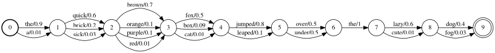
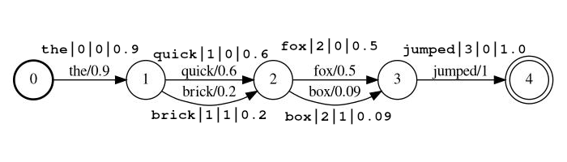
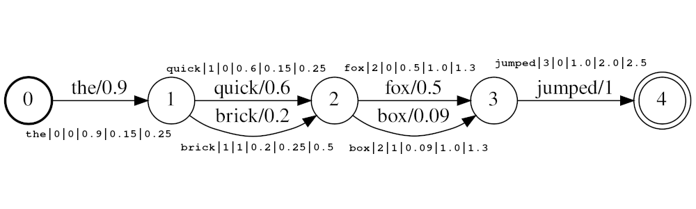
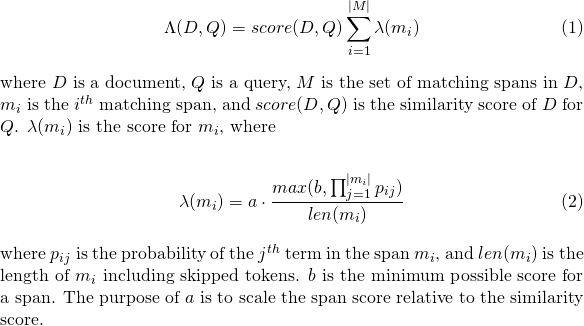
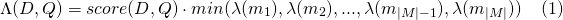
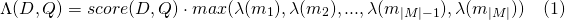
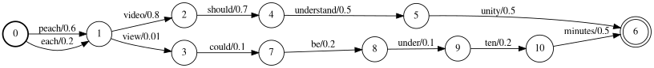
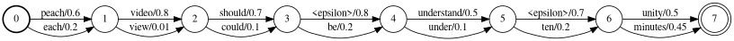

# Full Lattice Search

## Full Text Search Over Probabilistic Lattices with [Elasticsearch](https://github.com/elastic/elasticsearch)!



## Overview

This [Elasticsearch](https://github.com/elastic/elasticsearch) plugin enables search across transcripts in the form of
probabilistic lattice structures.  These lattices are in the form output by
Automated Speech Recognition
(ASR) or Speech-to-text (STT), Optical Character recognition (OCR), Machine Translation (MT), Automated Image Captioning,
etc.  The lattices, regardless of the analytic, can be viewed as the Finite State Machine (FST) structure below, 
where each set of arcs (transitioning from one state to another) represents a set of possible outputs at some location
in the source document (e.g. at the first location below, the possible outputs are 'the' and 'a'). 
In the case of STT the locations would be time ranges, in the case of OCR the locations could be x y
coordinates, or perhaps a reading order location.  Each possible output has an associated probability of occurrence at
that location allowing relevance scoring to be affected by the quality of the lattice output.

#### See [Getting Started](#Getting-Started) to try it out.

## Plugin

The plugin consists of three components:
- [LatticeTokenFilter](#LatticeTokenFilter) - A custom token filter to index lattice token streams, 
  which is designed to be used as a part of an
  analysis chain.
- [LatticeField](#LatticeField) - A custom field to store configuration of the LatticeTokenFilter for access at query time.
  (See the below section on the [LatticeField](#LatticeField) for an explanation as to why this is necessary)
- [MatchLatticeQuery](#MatchLatticeQuery) - A custom query to search [LatticeFields](#LatticeField) analyzed 
  with [LatticeTokenFilter](#LatticeTokenFilter)

### LatticeTokenFilter
A token filter of type `lattice` that processes a lattice token stream.  Tokens in the stream indicate the token 
position, allowing the stream to represent a lattice structure like the one above.  Tokens in the stream also have a
score, which is stored in the token payload when indexed so that is can be used to affect scoring.

The token filter accepts tokens in one of two formats.  The format set with the `lattice_format` parameter, which can
be set to `lattice`, or `audio`.

#### `lattice_format=lattice`
Tokens should be in the form 

`<token:string>|<position:int>|<rank:int>|<score:float>`

Example stream: `the|0|0|0.9`,  `quick|1|0|0.6`, `brick|1|1|0.2`, `fox|2|0|0.5`, `box|2|1|0.09`, `jumped|3|0|1.0`



In the example above the tokens `quick` and `brick` will be index at the same position, because they both have position
set to 1.

- `token` the actual string token to be searched against and to be processed by follow-on filters
- `position` is the global position of the token in the source document 
  (used to determine if the token should be places at same location as the previous token)
- `rank` the token's rank relative to the other possible tokens at this position (0 is the most probable rank)
- `score` a float between 0.0 and 1.0 (inclusive). The probability of a this token at this position. 
  Note if you actually have a score of zero the token will not return is a search, and should
  probably be omitted from the stream.

#### `lattice_format=audio`
Tokens have all the fields from the `lattice` format with the addition of `start_time` and `stop_time`.

Tokens should be in the form 

`<token:string>|<position:int>|<rank:int>|<score:float>|<start_time:float>|<stop_time:float>`

Example stream: `the|0|0|0.9|0.15|0.25`,  `quick|1|0|0.6|0.25|0.5`, `brick|1|1|0.2|0.25|0.5`, `fox|2|0|0.5|1.0|1.3`, `box|2|1|0.09|1.0|1.3`, `jumped|3|0|1.0|2.0|2.5`



In the example above the tokens `quick` and `brick` will be index at the same position, because they both have position
set to 1.  The actual position value of the tokens is determined by the times and `audio_position_increment_seconds`.
Currently the filter only looks a token start times

If `audio_position_increment_seconds=0.01` in the example above `the` would be indexed with a position of 15; 
`quick` and `brick` would be indexed at a position of 25; etc.

- `start_time` the start time in seconds of this token relative to the beginning of the source audio
- `stop_time` the start time in seconds of this token relative to the beginning of the source audio

Parameters include:
- `lattice_format` (default is lattice)
  - defines the fields in a lattice token either `audio` or `lattice`
  - allows positionIncrement to be affected by the distance between the tokens in the source document.  
    See `audio_position_increment_seconds`
- `score_buckets` (default is no duplication)
  - put duplicate tokens at the same position as the original token based on a score threshold.  This hacks the 
    term-frequency so that matches on higher scoring tokens will appear more relevant than lower scoring tokens.
    (See [Token duplication with score buckets](#Token-duplication-with-score-buckets) in the
    [Limitations](#Limitations) section below.)
  - for a value of `[0.9, 10, 0.8, 8, 0.7, 7, 0.2, 1]`, tokens with a score >= 0.9 will be duplicated 10 times; tokens
    with a score >= 0.8 will be duplicated 8 times, etc.
- `audio_position_increment_seconds` (default is 0.01)
  - for `lattice=format=audio` this is the precision at which the audio times are encoded into position in the index
  - position of a token will be `floor(token_start_time / audio_position_increment_seconds)`
 
 ### LatticeField
 
A field of type `lattice` holds parameters of LatticeTokenFilter for reference at search time. Functions exactly
like a [text field](https://www.elastic.co/guide/en/elasticsearch/reference/7.4/text.html).

**If you use `lattice_format=audio` you need to use a `lattice` field type for [MatchLatticeQueries](#MatchLatticeQuery)
  to work correctly with times.**

**Note:** this only exists because currently there does not seem to be a way to get the necessary (or any) information
from the analyzer at query time.  I think there could be a `getChainAware()` or similar method added to `AnalysisProvider`
functioning similar to `SynonymGraphTokenFilterFactory.getChainAwareTokenFilterFactory()` within `AnalysisRegistry`.
(For more details, see the comment at the top of
 [this class](src/main/java/com/eigendomain/eslatticeindex/mapper/LatticeFieldMapper.java))

Parameters include:
- `lattice_format` must match the configuration of the `LatticeTokenFilter` set on this field.
- `audio_position_increment_seconds` must match the configuration of the `LatticeTokenFilter` set on this field.

### MatchLatticeQuery

A query of type `match_lattice` queries a `lattice` field configured with a `lattice` token filter.

Performs a [SpanNearQuery](https://github.com/apache/lucene-solr/blob/master/lucene/core/src/java/org/apache/lucene/search/spans/SpanNearQuery.java)
wrapped in a [LatticePayloadScoreQuery](src/main/java/com/eigendomain/eslatticeindex/index/query/LatticePayloadScoreQuery.java)
(extension of [PayloadScoreQuery](https://github.com/apache/lucene-solr/blob/master/lucene/queries/src/java/org/apache/lucene/queries/payloads/PayloadScoreQuery.java)),
which uses the scores encoded in each token payload to score matching spans. The score from each span is combined to
give the document score (See the `payload_function` parameter for details). 
If `include_span_score` is set, the score above is multiplied by the configured similarity score.

Parameters include:
- `slop` number of skipped tokens allowed in match
- `slop_seconds` used when `lattice_format=audio`. Maximum seconds the match is allowed to span.
- `in_order` whether the token must appear in order (should be `true` for `lattice_format=audio`)
- `include_span_score` if `true` the configured similarity score will be multiplied with the payload score (described above)
- `payload_function` one of `sum`, `max`, or `min` (default is `sum`)
  - `sum` sums the scores of matching spans
  - `max` selects the max score from all the matching spans
  - `min` selects the min score from all the matching spans
- `payload_length_norm_factor` a float defining how much the length of the matching span should normalize the span score.
  A value of one means that score are divided by the length of the span (Note this in not the width of the span in lucene terms).
  A value of 0 means there is no length normalization.

#### Scoring

When using a `match_lattice` query with `payload_function=sum` a document score is computed (in principal) as



Similarly for `payload_function=min`



And for `payload_function=max`


  
## Getting Started

### Development 

#### [Docker](https://www.docker.com)

For development you can use the docker image below, which simply takes from official Elasticsearch image and installs
this plugin.  You can read [this](https://www.elastic.co/guide/en/elasticsearch/reference/current/docker.html) for
instructions on how to use the Elasticsearch images.

`docker pull messiaen/full-lattice-search:2.0.0-rc3-7.3.0`

#### [docker-compose](https://docs.docker.com/compose/)

`docker-compose.yaml` example:

```yaml
version: "2"
services:
  kibana:
    image: docker.elastic.co/kibana/kibana:7.3.0
    ports:
      - 5601:5601
    environment:
      ELASTICSEARCH_HOSTS: http://es01:9200
  es01:
    image: messiaen/full-lattice-search:2.0.0-rc3-7.3.0
    environment:
      - node.name=es01
      - discovery.type=single-node
      - "ES_JAVA_OPTS=-Xms1024m -Xmx1024m"
    ulimits:
      memlock:
        soft: -1
        hard: -1
    volumes:
      - esdata01:/usr/share/elasticsearch/data
    ports:
      - 9200:9200

volumes:
  esdata01:
    driver: local
```

Simply copy the yaml above into a file named docker-compose.yaml, and from that directory run `docker-compose up`
 
## Example Usage with [Kibana](https://www.elastic.co/guide/en/kibana/current/index.html)

Assuming you are using the `docker-compose.yaml` above navigate to `localhost:5601` in your browser and paste the 
following examples into Kibana's Dev Tools console.

### Usage with audio transcripts with times

```
PUT audio_lattices
{
  "settings": {
    "index": {
      "number_of_shards": 1,
      "number_of_replicas": 0
    },
    "analysis": {
      "analyzer": {
        "lattice_analyzer": {
          "type": "custom",
          "tokenizer": "whitespace",
          "filter": ["lattice_filter", "lowercase"]
        }
      },
      "filter": {
        "lattice_filter": {
          "type": "lattice",
          "lattice_format": "audio",
          "audio_position_increment_seconds": 0.1
        }
      }
    }
  },
  "mappings": {
    "dynamic": "strict",
    "properties": {
      "lattices": {
        "type": "lattice",
        "lattice_format": "audio",
        "audio_position_increment_seconds": 0.1,
        "analyzer": "lattice_analyzer"
      }
    }
  }
}

POST audio_lattices/_doc/1
{
  "lattices": """the|0|0|0.9|0.15|0.25
  quick|1|0|0.6|0.25|0.5 brick|1|1|0.2|0.25|0.5
  fox|2|0|0.5|1.0|1.3 box|2|1|0.09|1.0|1.3
  jumped|3|0|1.0|2.0|2.5"""
}

GET audio_lattices/_search
{
  "query": {
    "match_lattice": {
      "lattices": {
      
        "query": "quick box jumped",
        "slop_seconds": 2,
        "include_span_score": "true",
        "payload_function": "sum",
        "in_order": "true"
      }
    }
  }
}
```
[View in console](http://localhost:5601/app/kibana#/dev_tools/console?load_from=https://github.com/messiaen/full-lattice-search/blob/2-docs/doc/kibana_snippets/audio_lattices_snippet.console)

Search Response

```
{
  "took" : 1,
  "timed_out" : false,
  "_shards" : {
    "total" : 1,
    "successful" : 1,
    "skipped" : 0,
    "failed" : 0
  },
  "hits" : {
    "total" : {
      "value" : 1,
      "relation" : "eq"
    },
    "max_score" : 36.987705,
    "hits" : [
      {
        "_index" : "audio_lattices",
        "_type" : "_doc",
        "_id" : "1",
        "_score" : 36.987705,
        "_source" : {
          "lattices" : """
the|0|0|0.9|0.15|0.25
  quick|1|0|0.6|0.25|0.5 brick|1|1|0.2|0.25|0.5
  fox|2|0|0.5|1.0|1.3 box|2|1|0.09|1.0|1.3
  jumped|3|0|1.0|2.0|2.5
"""
        }
      }
    ]
  }
}
```

### Usage with text transcripts with position, rank, and score only

```
PUT text_lattices
{
  "settings": {
    "index": {
      "number_of_shards": 1,
      "number_of_replicas": 0
    },
    "analysis": {
      "analyzer": {
        "lattice_analyzer": {
          "type": "custom",
          "tokenizer": "whitespace",
          "filter": ["lattice_filter", "lowercase"]
        }
      },
      "filter": {
        "lattice_filter": {
          "type": "lattice",
          "lattice_format": "lattice"
        }
      }
    }
  },
  "mappings": {
    "dynamic": "strict",
    "properties": {
      "lattices": {
        "type": "lattice",
        "lattice_format": "lattice",
        "analyzer": "lattice_analyzer"
      }
    }
  }
}

POST text_lattices/_doc/1
{
  "lattices": """the|0|0|0.9
  quick|1|0|0.6 brick|1|1|0.2
  fox|2|0|0.5 box|2|1|0.09
  jumped|3|0|1.0"""
}

GET text_lattices/_search
{
  "query": {
    "match_lattice": {
      "lattices": {
      
        "query": "quick jumped",
        "slop": 1,
        "include_span_score": "true",
        "payload_function": "sum",
        "in_order": "true"
      }
    }
  }
}
```
[View in console](http://localhost:5601/app/kibana#/dev_tools/console?load_from=https://github.com/messiaen/full-lattice-search/blob/2-docs/doc/kibana_snippets/text_lattices_snippet.console)

Search Response

```
{
  "took" : 0,
  "timed_out" : false,
  "_shards" : {
    "total" : 1,
    "successful" : 1,
    "skipped" : 0,
    "failed" : 0
  },
  "hits" : {
    "total" : {
      "value" : 1,
      "relation" : "eq"
    },
    "max_score" : 9041.438,
    "hits" : [
      {
        "_index" : "text_lattices",
        "_type" : "_doc",
        "_id" : "1",
        "_score" : 9041.438,
        "_source" : {
          "lattices" : """
the|0|0|0.9
  quick|1|0|0.6 brick|1|1|0.2
  fox|2|0|0.5 box|2|1|0.09
  jumped|3|0|1.0
"""
        }
      }
    ]
  }
}
```

## Build from source

### Build Requirements 

- make
- java7 - java12
  - To run tests with the elasticsearch.esplugin gradle plugin you'll need to install each jdk and set `JAVA_HOME`
    environment variables for each.  (e.g. `JAVA7_HOME`, `JAVA8_HOME` ... , `JAVA11_HOME`) `JAVA_HOME` should point to
    jdk12.
    
### Build and Test

Simply run `make` in the root directory

If you wish to only build the plugin without running tests you can run 

`./gradlew clean assemble`

In either case, the built plugin will be `build/distributions/full-lattice-search-*.zip`

## Installation for Production

Requires [Elasticsearch 7.3.0](https://www.elastic.co/guide/en/elasticsearch/reference/7.3/install-elasticsearch.html)
(Support for other versions (>=6.0.0) coming soon / on request)

1. Download the appropriate release from [releases tab](https://github.com/messiaen/full-lattice-search/releases)
2. Install the plugin using the Elasticsearch docs [here](https://www.elastic.co/guide/en/elasticsearch/plugins/7.4/plugin-management-custom-url.html)
  or [here](https://www.elastic.co/guide/en/elasticsearch/plugins/7.4/_plugins_directory.html)
  
## Limitations

### Sausages


This plugin is not designed to work with generalized lattice structures, but to work with a compressed form known as a 
confusion network, or *sausage string*. A confusion 
network represents a generalized lattice with a fixed set of positions (time ranges, image locations, etc).  
Each position has a set of possible words, and each word has an associated likelihood of occurrence.  

For example an Automated Speech Recognizer could generate the lattice below where the speaker really said

*"Each video should be under ten minutes"*



The lattice above can be compressed into the confusion network below.



Note the `<epsilon>` tokens (meaning the absence of a word) have been inserted to allow for the word "understand' 
to have a longer duration than others.

It is also worth noting that the process of compressing a lattice into a confusion network is generally lossy, 
meaning that some paths through a confusion network are not present in the source lattice.  For example, the phrase
*"be understand ten minutes"* is present in the confusion network, but not in the lattice.

**Note you are responsible for ensuring your lattice structures are formatted a confusion networks.**

### Token duplication with score buckets

See [LatticeTokenFilter docs](#LatticeTokenFilter) for usage details.

As mentioned in the [LatticeTokenFilter docs](#LatticeTokenFilter), the `score_buckets` parameter may be used to index
duplicate tokens at the same position in order to boost the term-frequency of those tokens relative to there score.
Although this does have the desired affect, there few considerations.
1. **Index size:** Duplicating will increase the size of your indices, relative to how many duplicates you use.  This
  is somewhat in conflict with retrieval performance.  During testing of this technique for an ASR system it was found
  that a `8x` linear duplication of tokens
  (`score_buckets=[0.9, 72, 0.8, 64, 0.7, 56, 0.6, 48, 0.5, 40, 0.4, 32, 0.2, 16, 0.1, 8, 0.01, 2]`) performed much
  better than configurations with less duplication.
2. **Index speed**: too much duplication can lead to *very* slow index speeds, particularly if heavier follow-on Token Filters are
  used such the 
  [Phonetic Token Filter](https://www.elastic.co/guide/en/elasticsearch/reference/current/analysis-phonetic-tokenfilter.html),
  or some of the 
  [Stemmer Token Filters](https://www.elastic.co/guide/en/elasticsearch/reference/current/analysis-stemmer-tokenfilter.html#analysis-stemmer-tokenfilter)
  During testing of indexing with the `8x` duplication configuration in 1, removing the phonetic token filter from the
  analysis stream resulted in a 5x speedup in indexing.
3. **term-frequency hack:** Because we are hacking the term-frequency stats to affect relevance scoring, one
  possibility is that
  lattices will contain lots of low scoring instances of a single word.  In this case the 
  term-frequency for that word could be very high, and therefore look like a high quality match, when in fact it is
  not.  To help this documents should be kept small (lattice can be broken into segments). In general use of this hack /
  oversimplification requires careful testing for your specific use case.
